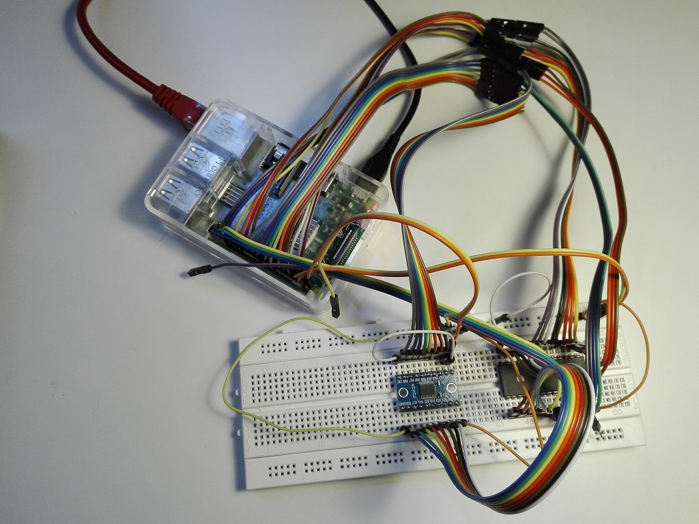
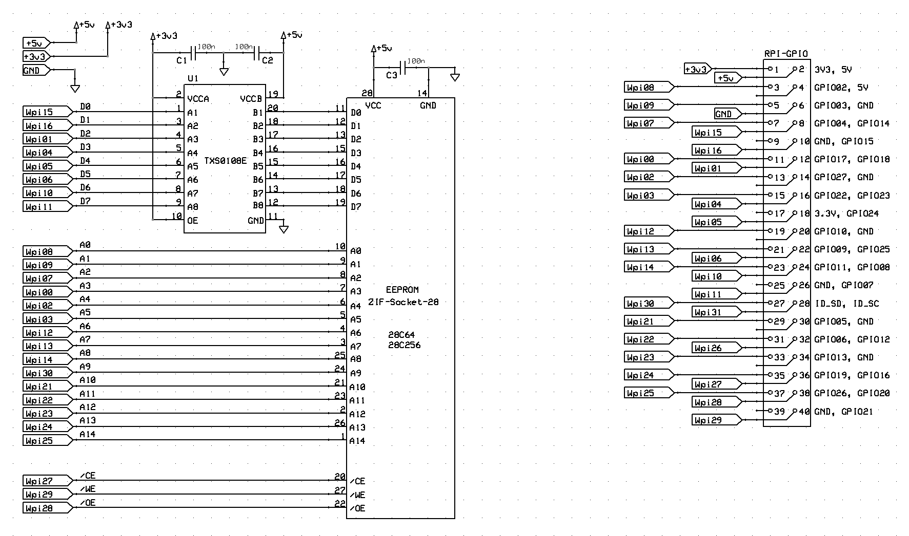

 # EEPROM 28C Programmer
**Type**: Programming Tool | **Status**: Completed

A simple parallel EEPROM programmer based on Raspberry PI (model 3).

It currently supports 28C16 (2Kx8), 28C64 (8Kx8) and 28C256 (32Kx8) EEPROMs, but it will probably work with all 28C-family (having all the necessary address-bus pins).





## Specifications
The hardware uses a standard Raspberry Pi 3 for its abundant GPIOs, avoiding the complexity of serial-to-parallel shift registers on the address bus.

* **Voltage Translation:** The voltage gap between the Raspberry Pi GPIOs (3.3V) and the EEPROM data bus (5V) is safely managed by a TXS0108 8-bit bidirectional voltage-level translator. The address and control lines are driven directly by the 3.3V GPIOs (they are EEPROM inputs only, and 3.3V is above their 2.0V V<sub>IH</sub> threshold).

* **Timing Management:**  the end of each write cycle is detected with DATA polling (bit D7 reads inverted until the cycle completes) instead of a fixed delay. Writes can be done byte by byte (all 28C devices) or by pages with -b 40 (64-byte pages of 28C64/28C256). Every block is verified, failed bytes are retried, and the whole written range is verified again at the end.


### Prerequisites / Requirements
To build and run this project:

* **Hardware:** Raspberry Pi Model 3 (or any model with enough available GPIOs), TXS0108 translator.

* **Software:** WiringPI library installed, standard GCC toolchain.


### Hardware
Schematics and PCB layouts are designed with ExpressPCB free CAD software.


#### Schematic:



### Software
The software is written in C and uses WiringPI for GPIO access, and the GNU Getopt function to automate the parsing of command-line options.

Below is the list of options with the relative allowed params, as shown in the help:

```
usage: eeprog28 option [params...]
EEPROM 28C programmer utility
  options:
    -t <LENGTH> [-s <START>] [-z <BLANK>]
        test if rom is filled with BLANK data values
    -d <LENGTH> [-s <START>] [-f <DATAFILE>] [-a]
        dump LENGTH bytes of rom, starting from START address, into DATAFILE (stdout: always ascii, with addresses)
    -e <LENGTH> [-s <START>] [-z <BLANK>] [-b <PAGESIZE>]
        erase LENGTH bytes (filled with BLANK values) of rom, starting from START address
    -v [<LENGTH>] [-s <START>] [-f <DATAFILE>] [-a]
        verify LENGTH bytes of rom, starting from START address, with the contents of DATAFILE
        if LENGTH is not specified or LENGTH is greater than DATAFILE length, the latter is used.
    -w [<LENGTH>] [-s <START>] [-z <BLANK>] [-f <DATAFILE>] [-a] [-b <PAGESIZE>]
        write LENGTH bytes of rom, starting from START address, with the contents of DATAFILE
        if LENGTH is not specified, DATAFILE length is used. If LENGTH is greater than DATAFILE length, diff is filled with BLANK values
    -l <MODE>
        enable (MODE=1) or disable (MODE=0) rom Software Data Protection
    -h: show this help and exit
  only one of -t, -d, -e, -v, -w, -l can be given
  params (LENGTH, START, BLANK and PAGESIZE are hex values; the optional LENGTH of -v/-w must start with a digit, e.g. 0A0):
    -s <START> set the start hex address, default value is 0x0
    -f <DATAFILE> set the datafile where to dump/read values, default is stdout (dump) or stdin (write/verify)
    -z <BLANK> set the blank hex data value to fill/test the rom, default value is 0xFF
    -b <PAGESIZE> enable page write mode with PAGESIZE hex bytes (40 for 28C64/28C256), default is byte mode
    -a set the mode of the datafile as ascii hex (default mode is binary); "XXXXX:" address labels are skipped
    -p show the value of input params and bus pin numbers
  exit status: 0 on success, 1 on error or verify/test mismatch
```

Notes:
* LENGTH, START and BLANK are hex values; the software checks them against the max ROM size (32K).
* Data files are binary by default, ascii hex with `-a` (dump, write and verify use the same format).
* The exit status is 1 on errors and on test/verify mismatch, so the tool can be used in scripts.
* A 28C16 is a 24-pin device, so it needs an adapter or rewiring. The 28C16 has no Software Data Protection: do not use `-l` with it.


## Changes
See file [CHANGES](CHANGES.md) for the project resources change logs.


## Future Plans
See file [TODO](TODO.md) for the project future plans.


## About & License
**Author**: Alessandro Fraschetti (gom9000).  
**Technical Notes**: The hardware design was supported by **ExpressPCB** and the custom **[expresspcb-goslib](https://github.com/gom9000/expresspcb-goslib)** libraries.  
**License**: This project is licensed under the [MIT License](LICENSE). 